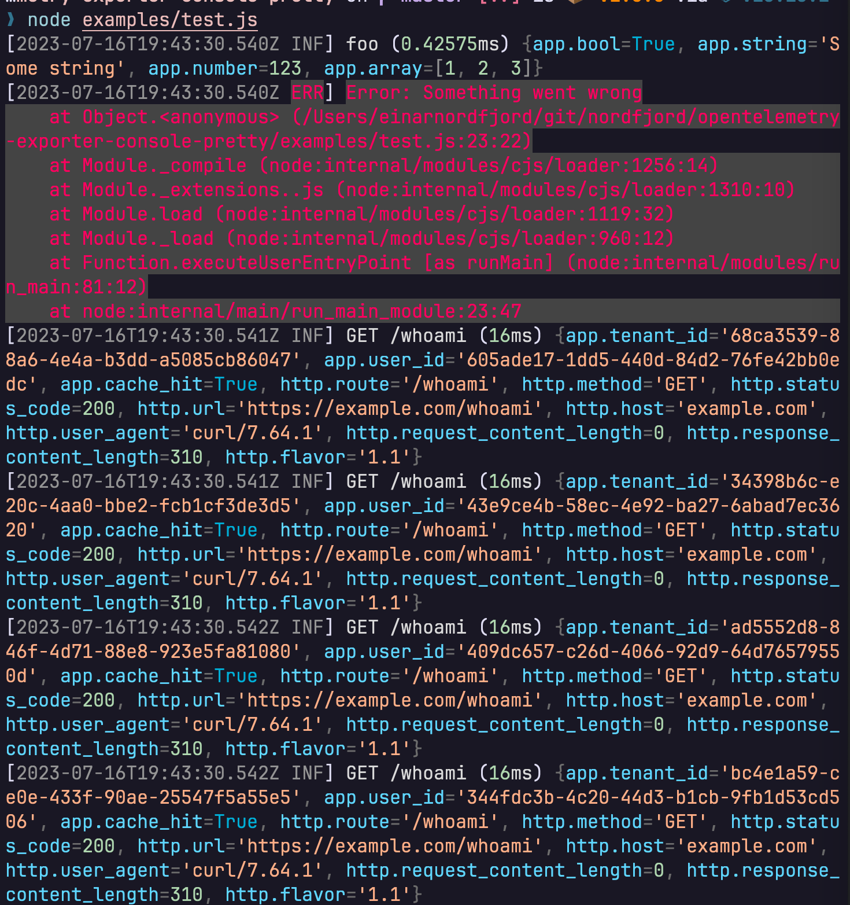

# Pretty Console Exporter For OpenTelemetry JS

## Getting started

1. Install via your package manager

```sh
$ pnpm add opentelemetry-exporter-console-pretty
$ yarn add opentelemetry-exporter-console-pretty
$ npm i -S opentelemetry-exporter-console-pretty
```

2. Use it as a span processor 

```js
const { NodeSDK } = require('@opentelemetry/sdk-node')
const { PrettyConsoleProcessor } = require('opentelemetry-exporter-console-pretty')

const sdk = new NodeSdk({
  spanProcessor: new PrettyConsoleProcessor(),
  instrumentations: [
    // your instrumentations
  ]
})
```

# Screenshot


